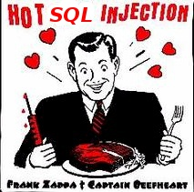

<h1 style="text-align: center">Hot SQL Injection</h1>

<h3 style="text-align: center">or, How I stopped worrying and learned
to love static type systems</h3>

# Is your Rails installation up-to-date?

What version of rails are you using?

> $ rails -v
> Rails 3.2.6

# Ruby on Rails SQL Injection

### From: Aaron Patterson &lt;tenderlove () ruby-lang org&gt;
### Subject: Ruby on Rails SQL Injection (CVE-2012-2695)
### Date: Tue, 12 Jun 2012 14:30:29 -0700

SQL Injection Vulnerability in Ruby on Rails

There is a SQL injection vulnerability in Active Record, in ALL
versions. This vulnerability has been assigned the CVE identifier
CVE-2012-2695.

Versions Affected:  ALL versions
Not affected:       NONE
Fixed Versions:     3.2.6, 3.1.6, 3.0.14

# Impact

Due to the way Active Record handles nested query parameters, an
attacker can use a specially crafted request to inject some forms of
SQL into your application's SQL queries.

# Example of impacted code

Impacted code directly passes request params to the `where` method of
an ActiveRecord class like this:

    Post.where(:id => params[:id]).all

An attacker can make a request that causes `params[:id]` to return a
specially crafted hash that will cause the WHERE clause of the SQL
statement to query an arbitrary table with some value.

Q: Did you update your Ruby on Rails installation to patch the latest
vulnerability? Describe the attack vector and how would you check for
the error in your own code?
A: All the answers are here: http://seclists.org/oss-sec/2012/q2/504

To win a prize people should be able to show that they understand the
answer and can explain it in some detail so everyone can be better
aware of these kinds of rampant problems that show up in code that
are not usually caught by the usual tests that people write.
