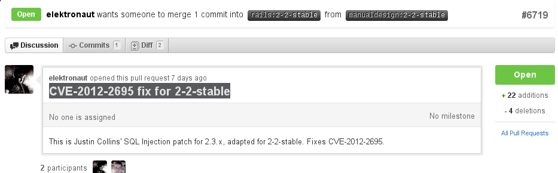

<h1 style="text-align: center">Hot SQL Injection</h1>

<h3 style="text-align: center">or, How I stopped worrying and learned
to love; DELETE * FROM ... oops!</h3>

~~~~
Content mostly lifted from:

Tom Moertel's
http://goo.gl/6kvJk

and

http://seclists.org/oss-sec/2012/q2/504
~~~~

# SQL Injection Vulnerability in Ruby on Rails 

### From: Aaron Patterson &lt;tenderlove () ruby-lang org&gt;
### Subject: Ruby on Rails SQL Injection (CVE-2012-2695)
### Date: Tue, 12 Jun 2012 14:30:29 -0700

~~~~
There is a SQL injection vulnerability in Active Record, in ALL
versions. This vulnerability has been assigned the CVE identifier
CVE-2012-2695.
~~~~

# What is a SQL Injection Attack?

### A SQL Injection attack is a form of attack that comes from user
### input that has not been checked to see that it is valid.

# Is your Rails installation up-to-date?

- What version of rails are you using?

~~~~
@@@ bash
$ rails -v
Rails 3.2.6
~~~~

# Affected versions

- What versions are affected?

~~~~
Versions Affected:  ALL versions
Not affected:       NONE
Fixed Versions:     3.2.6, 3.1.6, 3.0.14
~~~~

# Github pull request

### CVE-2012-2695 fix for 2-2-stable
https://github.com/rails/rails/pull/6719

# Impact

### Due to the way Active Record handles nested query parameters, an
### attacker can use a specially crafted request to inject some forms
### of SQL into your application's SQL queries.

# Example of impacted code

Impacted code directly passes request params to the `where` method of
an ActiveRecord class like this:

    Post.where(:id => params[:id]).all

An attacker can make a request that causes `params[:id]` to return a
specially crafted hash that will cause the WHERE clause of the SQL
statement to query an arbitrary table with some value.

# How would you check for the error in your own code?

### Tell me... how would *YOU* do it?

### BDD, TDD, ???DD

# Testing does not work!

### Despite its general effectiveness, testing is an inefficient
### way to defend against the perils of the strings problem.
  
# Why doesn't work?

### That’s because the strings problem is caused by knowledge
### deficits, which you can’t test for. If you don’t realize that you
### must escape one URL before you stuff it into another URL, you
### probably won’t think to write tests for that requirement.

# Like bad kids, keep languages separate

### A sound solution, therefore, should enforce the following
### fundamental, safe-string-handling rule: Do not allow strings that
### represent fragments of one language to be directly joined with
### strings that represent either plain text or fragments of another
### language.

# An answer...

### The trick is making the computer enforce this rule for us. As it
### turns out, modern type systems absolutely love to do this kind of
### thing.

# Static Typing...

### ...aka Haskell :)

## A type-based solution to the "strings problem": a fitting end to XSS and SQL-injection holes?</a>

http://blog.moertel.com/articles/2006/10/18/a-type-based-solution-to-the-strings-problem
